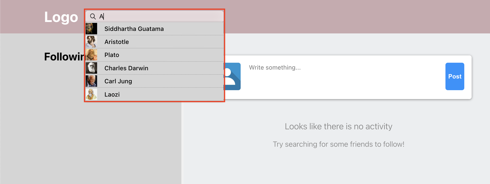
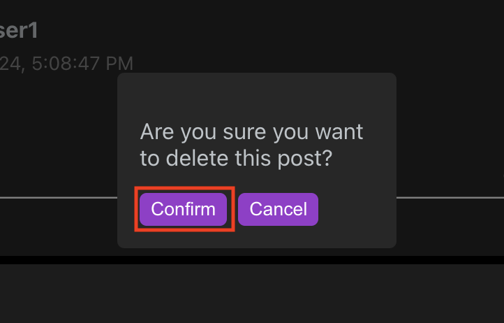

# User Manual
The following is a quick quide to demonstrate application features to users. With the exception of [uploading photos](#uploading-photos), all features are accessible to the demo version and don't require further setup. For details on setup, see the [setup guide]("www.github.com/mario-florio/social-media-app/docs/setup.md").

## Contents:
- [User Manual](#user-manual)
    - [Getting Started](#getting-started)
    - [Features](#features)

## Getting Started
The following will cover:
- [Creating an Account](#creating-an-account)
- [Finding Friends](#finding-friends)
- [Your First Post](#your-first-post)

Once starting the application, users are presented with a sign in form. Users can choose to sign in if they already have an account or make a new account by clicking on the blue link labeled "Sign Up" (see link below in red box).

### Creating an Account
If the user chooses to create a new account, upon clicking the sign up link they will be presented with a new form titled "Sign Up". The user can now enter their desired credentials.

While doing so, the sign up form provides the user with basic, inline form validation to assist with meeting form-field requirments prior to submission.

Once successfully signed up the user will be automatically signed in.

### Finding friends
Since a social media app is about socializing the user will first want to find others on the platform to connect with. The "Featured" section provides a quickway for users to do so, displaying several other users who are on the available on the platform (if user is on a mobile device, the featured section will be accessible via tab).

    
    

Users can also choose to search for other users using the search bar. Upon typing, the search bar will display any users whos name contains the queried input. User can then select any of the displayed users——doing so will redirect them to the said users profile.

Once at the selected users profile, the ability to follow that user will become available via a "Follow" button:

...and once followed, this user will appear in the sidemenu and their posts will appear in the feed of the home page of the user who followed them.

### Your first post
Being able to express yourself is a crucial part of social media applications. The major feature given to users to do so is *posting*. Posting is easy to do and is almost always available to the user. To post, all a user has to do is locate the post component (located at the top of the pages feed), input a message and click "Post".

Upon doing so the post will be published and availble for all of the users followers to read and interact with (e.g. like & comment). **(Note: if you post on a users profile, it will be visible on their profile feed——that is, the feed which is displayed on their profile.)**

## Features
- [Dark Mode](#dark-mode)
- [Editing and Deleting Posts](#editing-and-deleting-posts)
- [Likes and Comments](#likes-and-comments)
- [Editing Profile](editing-profile)
- [Uploading Photos](#uploading-photos)
- [Adjusting Settings](#adjusting-settings)
- [Changing Account Credentials](#changing-account-credentials)

### Dark Mode
Dark mode can be accessed by clicking on the user drop-down menu found in the top-right corner of the page (I.e. the user profile picture icon). Once the drop-down is activated the dark mode button can be found at the bottom and toggled.

Dark Mode active:

### Editing and Deleting Posts
The ability to edit and delete posts can be found within the posts options menu (an icon found at the top-right corner of the post, marked by three dots).

Once activated the posts options menu will give access to the "Edit Post" and "Delete Post" options.

#### Editing
Selecting the edit option will open a text box with the post body within it. The user can then edit the post body as desired, pressing submit when done. The edits will then be published.

#### Deleting
Selecting the delete option will open a window asking the user to confirm deletion. This confirmation will be proposed via a button labeled "Confirm". The user can also choose to cancel from here as well.

### Likes and Comments
Likes and comments can be accessed via the posts option menu (see [Editing and Deleting Posts](#editing-and-deleting-posts)), but they can also be accessed more convieniently on the post component itself.

#### Likes
Liking a post can be done by simply clicking on the "Like" link (found in bottom-left of post component). Similarly, all of the posts current likes can be accessed via the "[insert amount] likes" link (found in bottom-left of post component, above the "Like" link).

#### Comments
Comments can also be accessed through the post component via both the "Comment" and "[insert amount] comments" links.

Upon doing so the user will be redirected to a page dedicated to the post which displays all the posts comments. From here the user can comment on the post by typing the desired comment into the text box located at the bottom of the screen and finally pressing the "Send" button to publish it.

### Editing Profile
User profiles consist of two editable sections:
- the users bio
- the users profile picture & cover photo

#### Bio
The users bio can be edited in [settings](#adjusting-settings) within the "User" tab. Here the user will find a "Profile" section which will contain a text box for "Bio". Simply input the desired text, press the "Submit" button and the new bio will uploaded to your profile.

#### Profile Picture & Cover Photo
To edit the profile picture & cover photo, the user must go to their profile and click on either of said items. Once clicked an uploader popup will appear and allow them to either upload a new image or choose from a default selection. With the upload or selection made, the user can then click the respective button to make the edit ("Upload" button for uploading; "Select" button for selecting). Now the profile will be updated and the image will be uploaded to the users [photo albums](#uploading-photos).

### Uploading Photos
A users photo albums can be found on their profile. To access the photos click the tab labeled "Photos". This will display the users photo albums, at which point any of the albums can be opened to display their photos.

Once an album is opened, assuming the user is the owner of the album, the user can upload photos. To do so they can click the add icon in the bottom-right corner of the page. Doing so will prompt an upload form to open, at which point the user will need to select which album they are uploading to, the image they would like to upload, as well as a "Name" and any "Caption" they may like to assign to it.

Upon successful upload the image will appear in the users photo album and be available for others to see. **(Note: Demo version will not be able to upload images to a database, so any changes that occur will be temporary and reset upon leaving the page.)**

### Adjusting Settings
Links to the settings page can be found in the user drop-down menu.

Settings has two main sections:
- General
- User

The following will cover *General* settings. To learn more about *User* settings see [Changing Account Credentials](#changing-account-credentials) and [Editing Profile: Bio](#bio).

#### General

The general settings allow the user to adjust the color theme displayed on the UI. This includes the background color, the primary color (I.e. the top bar), and target color (e.g. button & link colors) amongst other components and their attributes. The default theme can also be restored easily enough using the "Restore Defaults" button.

##### Note: General settings are saved to *local storage*. Thus, it follows that if local storage data is cleared for whatever reason (e.g. clearing cookies, refreshing demo version of app, etc) settings will be lost.

### Changing Account Credentials
Account credentials can be edited in the [settings](#adjusting-settings) under the "User" tab. Here the user will find fields dedicated their username & password in the section titled "Acount".

The user will be prompted with inline error validation upon entering information. If the user chooses to edit password, they will be prompted to confirm password before submitting.

