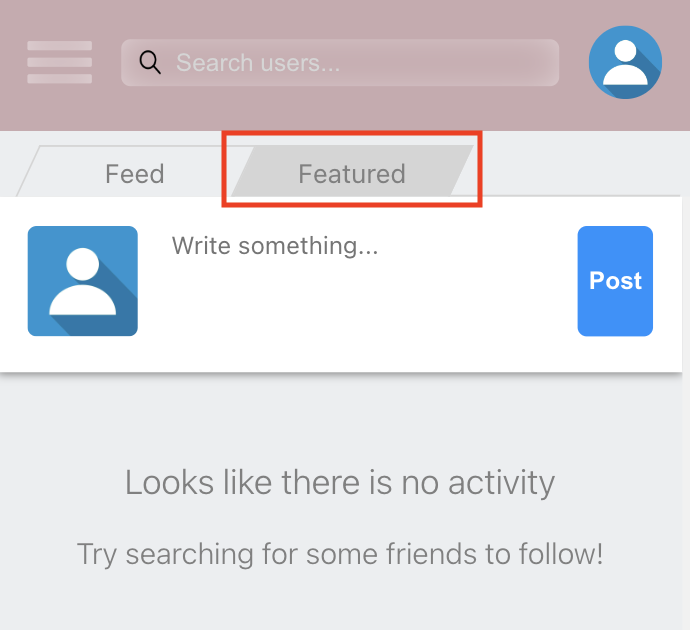
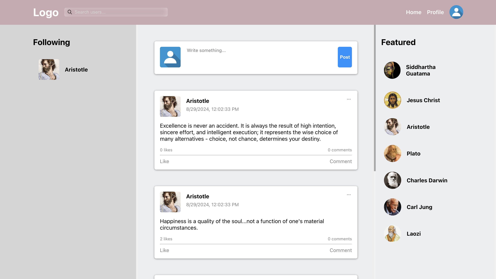
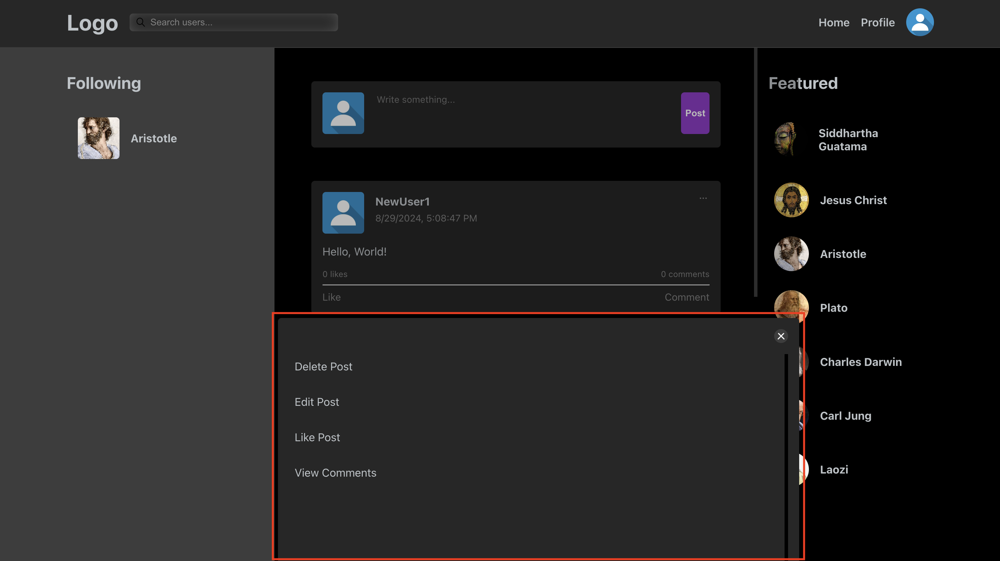
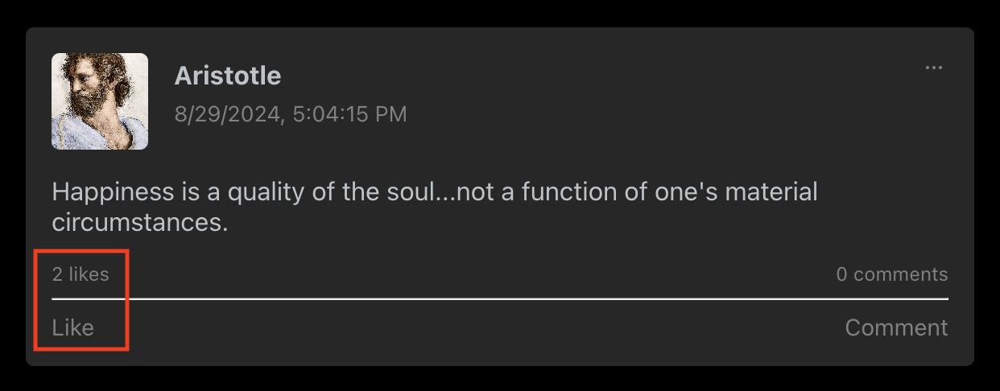

# User Manual

The following is a quick **guide** to demonstrate application features to users. With the exception of [uploading photos](#uploading-photos), all features are accessible in the demo version and do not require further setup. For setup details, see the [setup guide](./setup.md).

## Contents:
- [User Manual](#user-manual)
    - [Getting Started](#getting-started)
    - [Features](#features)

## Getting Started

The following will cover:  
- [Creating an Account](#creating-an-account)  
- [Finding Friends](#finding-friends)  
- [Your First Post](#your-first-post)

Upon starting the application, users are presented with a sign-in form. Users can either sign in if they already have an account or create a new account by clicking the blue link labeled "Sign Up" (see link below in the red box).

### Creating an Account

If the user chooses to create a new account, clicking the sign-up link will present a form titled "Sign Up". The user can then enter their desired credentials.

The sign-up form provides basic, inline validation to assist with meeting form-field **requirements** prior to submission.

Once successfully signed up, the user will be automatically signed in.

### Finding Friends

Since a social media app is about socializing, the user will first want to find others on the platform to connect with. The "Featured" section provides a quick way for users to do so, displaying several other users currently available on the platform. (If the user is on a mobile device, the featured section will be accessible via tab.)

    
    

Users can also search for others using the search bar. Upon typing, the search bar will display any users whose name contains the queried input. The user can then select any displayed user—doing so will redirect them to that user’s profile.

Once on the selected user's profile, the ability to follow that user becomes available via a "Follow" button:

Once followed, this user will appear in the side menu, and their posts will appear in the feed on the home page of the user who followed them.

### Your First Post

Expressing yourself is a crucial part of social media. The primary feature for this is *posting*. Posting is easy and almost always available. To post, the user locates the post component (at the top of the page’s feed), inputs a message, and clicks "Post".

Once submitted, the post is published and available for all the user’s followers to read and interact with (e.g., like & comment). **(Note: If you post on a user’s profile, it will be visible on their profile feed—the feed displayed on their profile.)**

## Features
- [Dark Mode](#dark-mode)
- [Editing and Deleting Posts](#editing-and-deleting-posts)
- [Likes and Comments](#likes-and-comments)
- [Editing Profile](#editing-profile)
- [Uploading Photos](#uploading-photos)
- [Adjusting Settings](#adjusting-settings)
- [Changing Account Credentials](#changing-account-credentials)

### Dark Mode

Dark mode can be accessed by clicking on the user drop-down menu found in the top-right corner of the page (i.e., the user profile picture icon). Once the drop-down is activated, the dark mode toggle button can be found at the bottom.

Dark Mode active:

### Editing and Deleting Posts

The ability to edit and delete posts can be found within the post's options menu (an icon at the top-right corner of the post, marked by three dots).

Once activated, the post options menu provides access to "Edit Post" and "Delete Post" options.

#### Editing

Selecting the edit option opens a text box containing the post body. The user can then edit the post as desired and press submit. The edits will then be published.

#### Deleting

Selecting delete opens a confirmation window asking the user to confirm deletion. Confirmation is via a button labeled "Confirm". The user can also cancel here.

### Likes and Comments

Likes and comments can be accessed via the post’s options menu (see [Editing and Deleting Posts](#editing-and-deleting-posts)), but are also more conveniently accessed on the post component itself.

#### Likes

Liking a post is done by clicking the "Like" link (found in the bottom-left of the post component). All current likes can be accessed via the "[insert amount] likes" link (found above the "Like" link).

#### Comments

Comments can be accessed through the post component via both the "Comment" and "[insert amount] comments" links.

Clicking these links redirects the user to a page dedicated to the post, displaying all comments. From here the user can comment by typing in the text box at the bottom of the screen and pressing the "Send" button.

### Editing Profile

User profiles consist of two editable sections:  
- The user’s bio  
- The user’s profile picture & cover photo

#### Bio

The user’s bio can be edited in [Settings](#adjusting-settings) within the "User" tab. Here the user finds a "Profile" section containing a text box for "Bio". Input the desired text and press "Submit" to update the profile.

#### Profile Picture & Cover Photo

To edit the profile picture or cover photo, go to your profile and click the image you want to change. An uploader popup will appear, allowing you to upload a new image or choose from a default selection. After uploading or selecting, click the respective button ("Upload" or "Select") to update the profile and upload the image to your [photo albums](#uploading-photos).

### Uploading Photos

A user’s photo albums can be found on their profile. Click the "Photos" tab to view the albums. Any album can be opened to display photos.

Once an album is opened, assuming the user owns the album, photos can be uploaded by clicking the add icon in the bottom-right corner. This opens an upload form where the user selects the album, image, and optionally adds a "Name" and "Caption".

Upon successful upload, the image will appear in the user’s photo album and be visible to others.  
**(Note: The demo version cannot upload images to a database, so changes are temporary and reset upon leaving the page.)**

### Adjusting Settings

Links to the Settings page can be found in the user drop-down menu.

Settings has two main sections:  
- General  
- User

The following covers *General* settings. For *User* settings, see [Changing Account Credentials](#changing-account-credentials) and [Editing Profile: Bio](#bio).

#### General

General settings allow the user to adjust the UI color theme, including background color, primary color (e.g., top bar), and target color (e.g., buttons and links). The default theme can be restored using the "Restore Defaults" button.

##### Note: General settings are saved to *local storage*. Therefore, clearing local storage data (e.g., clearing cookies or refreshing the demo version) will reset settings.

### Changing Account Credentials

Account credentials can be edited in [Settings](#adjusting-settings) under the "User" tab. Here the user will find fields for username and password under the "Account" section.

Users receive inline error validation when entering information. If editing the password, they must confirm the password before submitting.

